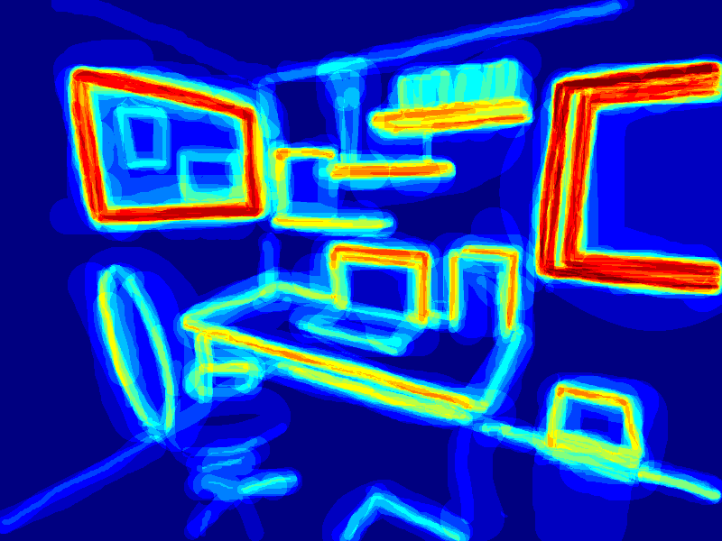
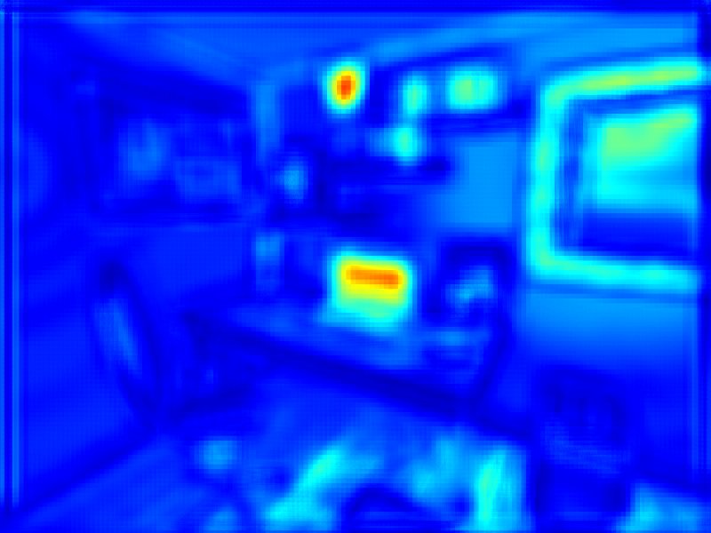

# This is a PyTorch implementation of the [Predicting Visible Image Differences Under Varying Display Brightness and Viewing Distance](https://openaccess.thecvf.com/content_CVPR_2019/html/Ye_Predicting_Visible_Image_Differences_Under_Varying_Display_Brightness_and_Viewing_CVPR_2019_paper.html) in CVPR 2019

## Code Usage:

`python example.py --ref reference.png --dist distorted.png --ppd 60 --lumin 110 --load_path path/to/model.pth --output output.png`

The models are available [here](https://drive.google.com/file/d/1ikCXlb_QxytuZ32pU2aOOQsFY9aEOwP_/view?usp=share_link)

## Sample Results:

The label is:

And the prediction is:

The image is from `marking_aliasing/Attic_Aliasing_l1_aliasing`. The ppd is 40 and the luminance is 110.

## Notes:
We have implemented network architecture used in the paper. In the future, we will migrate the loss function from tensorflow to PyTorch. This can serve as a basic implementation of the paper and a footfold for future works.
